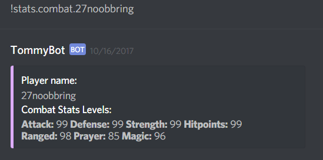
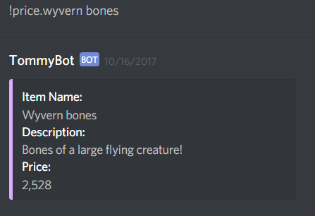
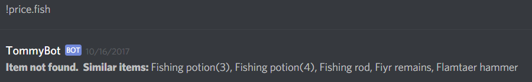
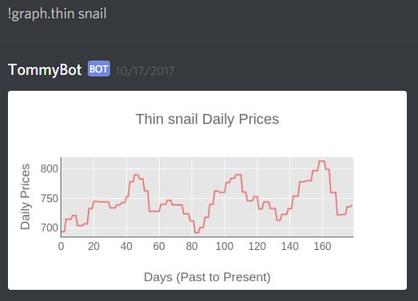
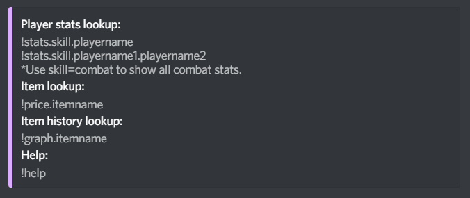

# RunescapeDiscordBot
A bot for Discord (https://discordapp.com/) created during and after HackRU 2017.  
The bot is designed to fetch and process data from the Runescape API to display to users.  
Created using the node js framework.  
  
Reads in user commands from the chat room of the discord server and processes them to output information.  
The bot relies on a publically available JSON file of item names and item ids.  This allows the bot to process item names into item ids in order to use the Runescape APIs.  The goal of making this bot was to begin to learn javascript, how to work with JSON files, work with web APIs, and build a usable tool with features as requested by a player of Runescape.  
  
Commands include 'stats', 'price', 'graph', and 'help'.  
* 'stats' takes in one or two player-names and displays specific user-requested stats with level and XP, or all stats with the levels displayed.  
  
* 'price' takes in an item name and fetches and displays the item description and price to the user.  If the item is not found, similar items are suggested to the user.  
  
* 'graph' takes in an item name and fetches past price data over time for the item, generates a graph with plotly, saves it to the server running the bot, and then uploads it to the chatroom for display as a time-series graph.  
  
* 'help' privately messages the user with the possible commands.  
  
Sample outputs:   

